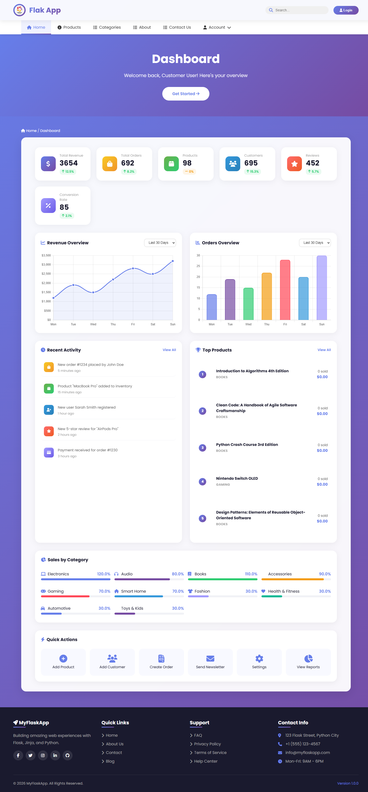
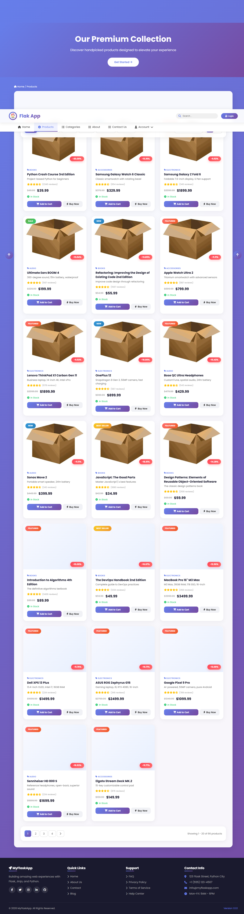
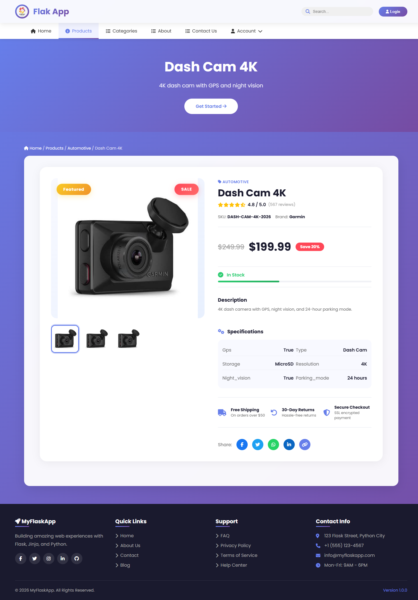

# Flask Project

This repository contains a Flask web application built with Python. The project includes standard Flask setup, templates, static files, and page routes. Screenshots for the application are stored in `static/screenshots`.

## Project Overview

- Flask application with routing for multiple pages.
- HTML templates stored in the `templates` folder.
- Static assets such as CSS, JavaScript, images, and screenshots stored in the `static` folder.
- `static/screenshots` contains saved screenshots that demonstrate the UI and pages.

## Requirements

- Python 3.7 or newer
- Flask
- Any additional dependencies specified in your local environment or requirements file

## Installation

1. Create a virtual environment:

   ```bash
   python -m venv venv
   ```

2. Activate the virtual environment:

   - Windows:
     ```bash
     venv\Scripts\activate
     ```

   - macOS/Linux:
     ```bash
     source venv/bin/activate
     ```

3. Install Flask and other dependencies:

   ```bash
   pip install Flask
   ```

4. If you have a `requirements.txt` file, install dependencies from it:

   ```bash
   pip install -r requirements.txt
   ```

## Running the Application

From the project root directory, run the Flask app. The exact command depends on your app entry point, but typical commands are:

```bash
export FLASK_APP=app.py       # macOS/Linux
set FLASK_APP=app.py          # Windows
flask run
```

Or run the main script directly if the project uses an executable script:

```bash
python app.py
```

Open a browser and go to `http://127.0.0.1:5000/`.

## Project Structure

A typical Flask project structure for this repository is:

- `app.py` or `run.py` - main application entry point
- `templates/` - HTML template files for the pages
- `static/`
  - `css/` - stylesheets
  - `js/` - JavaScript files
  - `images/` - image assets
  - `screenshots/` - project screenshots

## Pages and Routes

The project is organized around standard Flask routes and page templates. Common pages include:

- `/` - home page
- `/about` - about page
- `/contact` - contact page
- `/login` - login page
- `/register` or `/signup` - user registration page
- `/dashboard` - authenticated user dashboard

Each page is usually rendered from a template in the `templates` directory, for example:

```python
from flask import Flask, render_template

app = Flask(__name__)

@app.route('/')
def index():
    return render_template('index.html')

@app.route('/about')
def about():
    return render_template('about.html')

@app.route('/login')
def login():
    return render_template('login.html')
```

Update these routes to match the actual pages in your project.

## Templates

Templates are stored in the `templates` directory and typically extend a base layout. Example file names:

- `base.html`
- `index.html`
- `about.html`
- `contact.html`
- `login.html`
- `register.html`
- `dashboard.html`

Use Jinja2 templating for shared layout, navigation, and dynamic content.

## Static Screenshots

Screenshots for the project are located in `static/screenshots`. Use these images to illustrate page designs, user flows, and UI states.

Example screenshot file names may include:

- `home.png`
- `login.png`
- `dashboard.png`
- `about.png`

Reference screenshots in documentation or README using Markdown image syntax:

```markdown

```

```markdown

```

```markdown

```


## Notes

- Keep the application configuration minimal and use environment variables for sensitive values.
- If the project uses Blueprints or a package layout, adapt the structure accordingly.
- Ensure templates and static paths are correct when rendering pages.

## Contribution

To contribute or extend the project:

- Add new routes in the Flask app
- Create corresponding templates in `templates`
- Add styles and assets in `static`
- Update the README with page-specific details and screenshot references

---

This README provides a complete and comprehensive overview of the Flask project setup, including page routing and screenshot management.